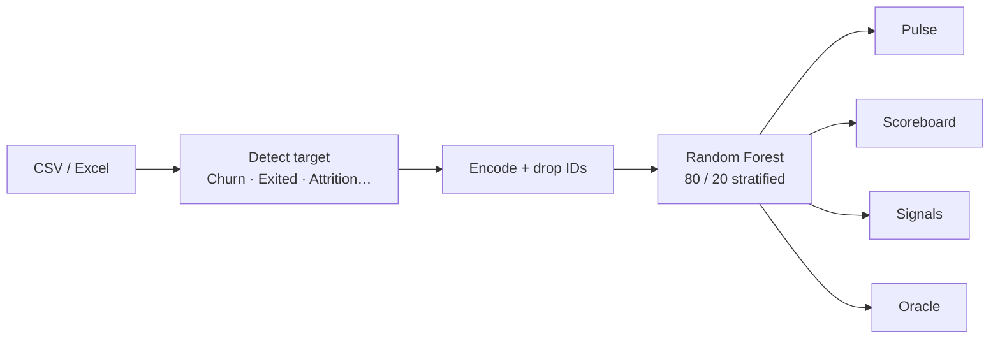

<p align="center">
  
</p>

<h1 align="center">◈ ChurnPulse</h1>

<p align="center">
  <b>A live retention intelligence studio.</b><br/>
  Upload a customer dataset. Watch a Random Forest learn who is about to leave.
</p>

<p align="center">
  <a href="https://churnpulse-gcr.streamlit.app"></a>
  <a href="https://github.com/Fredrick2216/churnpulse-gcr"></a>
</p>

<p align="center">
  
  
  
  
  
</p>

---

> **For GCR / faculty review**  
> Do not clone first. Open the live studio: **[https://churnpulse-gcr.streamlit.app](https://churnpulse-gcr.streamlit.app)**  
> The site starts empty. Upload any `.csv` / `.xlsx` / `.xls` with a churn-like target column. Metrics and charts are built from *that* file only.

---

## Why this exists

Classroom notebooks stop when the laptop closes. ChurnPulse is the same Random Forest workflow — inspect, split, train, score, explain — turned into a dark, responsive command center that stays online on Streamlit Cloud.

```
  laptop off  ──►  URL still live  ──►  teacher opens Pulse
                         │
                         ▼
              upload dataset  →  forest trains  →  risk score
```

No dummy customers are preloaded. If nobody has uploaded a file, the studio is quiet on purpose.

---

## Studio map

Five rooms. One model. Your data.

| Room | What happens |
|:---|:---|
| **Pulse** | Landing KPIs, cohort chart, train vs test gap |
| **Observatory** | Shape, schema, missingness, numeric summary, preview |
| **Scoreboard** | Accuracy, precision, recall, F1, confusion matrix, report, downloadable predictions |
| **Signals** | Ranked feature importance from the forest |
| **Oracle** | Live customer profile → Stay / Churn probability + retention playbook |



---

## How a file becomes intelligence

1. **Drop a dataset** in the sidebar or on Pulse.  
2. The backend guesses the target (`Churn`, `Exited`, `Attrition`, `Left`, …) — you can override it.  
3. ID-like columns are dropped. Categoricals are encoded. Missing values are filled.  
4. A Random Forest trains with the original Colab hyperparameters.  
5. Charts, metrics, and the Oracle all recompute from **your** columns — not a canned telecom sample.

Default forest (same spirit as the notebook):

```python
RandomForestClassifier(
    n_estimators=100,
    criterion="gini",
    max_depth=5,
    min_samples_split=10,
    min_samples_leaf=5,
    random_state=42,
)
```

Trees, depth, split, leaf, and test size are live sliders. **Retrain Random Forest** rebuilds everything.

---

## Architecture

```
churnpulse-gcr
├── app.py                  ← Streamlit UI  (Pulse · Observatory · Scoreboard · Signals · Oracle)
├── backend/
│   ├── __init__.py
│   └── pipeline.py         ← load · inspect · encode · train · predict
├── .streamlit/config.toml  ← dark theme
├── requirements.txt
└── runtime.txt             ← Python 3.12 on Cloud
```

| Layer | Role |
|:---|:---|
| `app.py` | Responsive dark UI, upload, KPI cards, Plotly, Oracle form |
| `backend/pipeline.py` | The ML engine — no Colab `files.upload()`, no hidden demo boot |

---

## Run locally

```bash
git clone https://github.com/Fredrick2216/churnpulse-gcr.git
cd churnpulse-gcr
pip install -r requirements.txt
streamlit run app.py
```

Open [http://localhost:8501](http://localhost:8501). Upload a file. Train happens automatically.

---

## Dataset contract

The studio is format-flexible. It does **not** require the IBM Telco schema.

| Need | Detail |
|:---|:---|
| File | `.csv` · `.xlsx` · `.xls` |
| Rows | At least one |
| Columns | At least two |
| Target | Binary-ish column named something like `Churn` / `Exited` / `Attrition`, or any 2-class column you pick |
| IDs | `CustomerID`-style fields are dropped automatically |

Yes/No, 0/1, True/False, and labels such as *Attrited Customer* are mapped to Stay vs Churn.

---

## What “good” looks like in the UI

```
┌──────── Pulse ────────┐  ┌──── Scoreboard ────┐
│  rows · columns       │  │  accuracy  .704    │
│  positive rate        │  │  precision / recall│
│  hold-out accuracy    │  │  F1 · confusion    │
│  cohort + train/test  │  │  download CSV      │
└───────────────────────┘  └────────────────────┘
┌────── Signals ────────┐  ┌────── Oracle ──────┐
│  feature ranking      │  │  risk band         │
│  strongest driver     │  │  Stay / Churn %    │
└───────────────────────┘  │  gauge + playbook  │
                           └────────────────────┘
```

Phone and laptop: KPI cards reflow (4 → 2 → 1), charts stack, sidebar starts collapsed on small screens.

---

## Stack

```
Streamlit ──► Pandas / NumPy ──► scikit-learn RandomForest
                 │
                 └── Plotly  (confusion · importance · gauge · cohorts)
```

---

## Submit this

| Field | Value |
|:---|:---|
| Live demo | https://churnpulse-gcr.streamlit.app |
| Source | https://github.com/Fredrick2216/churnpulse-gcr |
| Entry point | `app.py` |
| Host | Streamlit Community Cloud · stays up when the laptop is off |

<p align="center">
  <sub>Built as a Random Forest retention studio — not a notebook screenshot.</sub>
</p>
